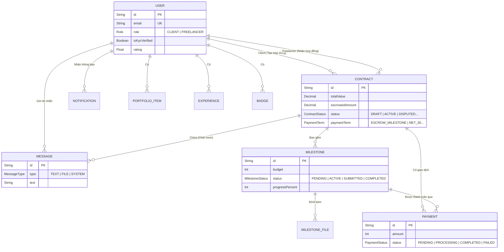

# Database Schema (FreelancePact)

Tài liệu này mô tả cấu trúc cơ sở dữ liệu của hệ thống, được quản lý bằng **Prisma ORM** và lưu trữ trên **PostgreSQL**.

> **Mục đích:** Tài liệu này giúp Developer hoặc AI nắm bắt nhanh luồng quan hệ dữ liệu cốt lõi, dễ dàng đối chiếu với luồng Web3 (Cardano) mà không cần đọc nguyên file `schema.prisma`.

---

## 1. Entity Relationship Diagram (ERD)

---

## 2. Giải thích Các Thực Thể Chính (Core Entities)

### 2.1. Bảng `User`
- Phân biệt 2 role: **Client** và **Freelancer**.
- Chứa các thông tin cá nhân và điểm uy tín (`rating`).
- Liên kết với NFT đúc trên Cardano: Các NFT chứng nhận (hoặc `Badge`) sẽ được liên kết gián tiếp hoặc trực tiếp với địa chỉ ví của User trên hệ thống.

### 2.2. Bảng `Contract` (Hợp đồng)
- Kết nối `Client` và `Freelancer`.
- **`escrowedAmount`**: Là số lượng quỹ ADA đang được khóa trong Smart Contract thực tế trên mạng Cardano. Giá trị này ở Database chỉ mang tính chất hiển thị và đồng bộ với On-chain.
- Có trạng thái `DISPUTED` (Tranh chấp), lúc này DAOPilot AI sẽ chờ quyết định từ cộng đồng/bên thứ 3.

### 2.3. Bảng `Milestone` (Cột mốc) & `Payment`
- Một hợp đồng chia thành nhiều cột mốc (`Milestone`).
- Khi hai bên xác nhận hoàn thành (Milestone `status` = `COMPLETED`), sự kiện này sẽ kích hoạt **DAOPilot AI Agent** gọi Smart Contract giải ngân.
- Sau khi AI giải ngân ADA thành công on-chain, hệ thống sẽ cập nhật trạng thái bảng `Payment` thành `COMPLETED`.

### 2.4. Bảng `Notification`
- Nhận thông báo đa dạng, đặc biệt là `NotificationType.NFT_MINTED` khi hợp đồng hoàn thành và Freelancer được đúc NFT uy tín trên mạng Cardano.
