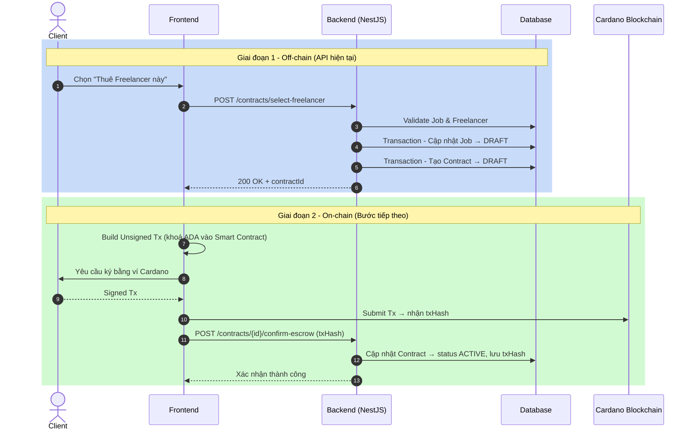

# 📄 Tài Liệu API: Contracts Controller

**File nguồn:** `src/contracts/contracts.controller.ts`
**Base URL:** `/contracts`
**Authentication:** Tất cả các endpoint đều yêu cầu JWT Bearer Token

để kiểm thử
cd c:\Users\Admin\VSCODE\hakathon\FreelancePact-be
npx ts-node src/test-cli.ts

---

## Tổng Quan

Module `Contracts` xử lý toàn bộ logic liên quan đến **hợp đồng làm việc** giữa Client và Freelancer trên nền tảng FreelancePact. Dự án tích hợp với mạng **Cardano Blockchain** để đảm bảo tính minh bạch và an toàn cho việc escrow thanh toán.

---

## Danh Sách API

### 1. `POST /contracts` — Tạo Hợp Đồng Mới Với Milestones

| Thuộc tính             | Giá trị                      |
| ------------------------ | ------------------------------ |
| **Phương thức** | `POST`                       |
| **URL**            | `/contracts`                 |
| **Auth**           | Bearer JWT (Client/Freelancer) |
| **HTTP Code**      | `201 Created`                |

#### Request Body (`CreateContractDto`)

```json
{
  "title": "Thiết kế Website Thương mại điện tử",
  "partnerName": "Acme Corporation",
  "description": "Mô tả ngắn gọn về phạm vi công việc...",
  "paymentTerm": "escrow-milestone",
  "specialTerms": "Bảo mật NDA trong 2 năm",
  "milestones": [
    {
      "name": "Liên ý tưởng thiết kế",
      "budget": 5000000,
      "deadline": "2024-11-15"
    }
  ]
}
```

| Trường         | Kiểu  | Bắt buộc | Mô tả                                                       |
| ---------------- | ------ | ---------- | ------------------------------------------------------------- |
| `title`        | string | ✅         | Tiêu đề hợp đồng                                        |
| `partnerName`  | string | ✅         | Tên đối tác                                               |
| `description`  | string | ❌         | Mô tả hợp đồng                                           |
| `paymentTerm`  | enum   | ✅         | `escrow-milestone`, `escrow-full`, `net-15`, `net-30` |
| `specialTerms` | string | ❌         | Điều khoản đặc biệt                                     |
| `milestones`   | array  | ✅         | Danh sách mốc công việc (ít nhất 1 mốc)                |

#### Response Thành Công (`201`)

```json
{
  "id": "cmqxt9iz80005l8x2a2nvmex0",
  "title": "Thiết kế Website Thương mại điện tử",
  "partnerName": "Acme Corporation",
  "status": "draft",
  "totalValue": 5000000,
  "escrowedAmount": 0,
  "paymentTerm": "escrow-milestone",
  "milestones": [
    {
      "id": "cmqxt9...",
      "name": "Liên ý tưởng thiết kế",
      "budget": 5000000,
      "deadline": "2024-11-15",
      "status": "pending",
      "progressPercent": 0
    }
  ]
}
```

#### Luồng Xử Lý Nội Bộ

```
Client gửi Request
      │
      ▼
JwtAuthGuard (Xác thực Token)
      │
      ▼
ContractsController.createContract()
      │
      ▼
ContractsService.createContract()
      ├─ Kiểm tra milestones.length >= 1
      ├─ Tính totalValue = tổng budget các milestones
      ├─ Resolve clientId / freelancerId từ role của người dùng
      └─ prisma.contract.create() + milestones (1 transaction)
      │
      ▼
Trả về ContractDetail (201 Created)
```

---

### 2. `POST /contracts/select-freelancer` — Chọn Freelancer & Khởi Tạo Hợp Đồng Nháp (Cardano)

| Thuộc tính             | Giá trị                        |
| ------------------------ | -------------------------------- |
| **Phương thức** | `POST`                         |
| **URL**            | `/contracts/select-freelancer` |
| **Auth**           | Bearer JWT (Client only)         |
| **HTTP Code**      | `200 OK`                       |

#### Request Body (`SelectFreelancerDto`)

```json
{
  "jobId": "cmqxt9iyn0004l8x2slvy5huf",
  "freelancerId": "cmqxt9iya0002l8x2speymfa0"
}
```

| Trường         | Kiểu  | Bắt buộc | Mô tả                     |
| ---------------- | ------ | ---------- | --------------------------- |
| `jobId`        | string | ✅         | ID bài đăng tuyển dụng |
| `freelancerId` | string | ✅         | ID freelancer được chọn |

#### Response Thành Công (`200`)

```json
{
  "message": "Tạo hợp đồng nháp thành công. Client có thể tiến hành tạo giao dịch Smart Contract (CBOR hex) để ký duyệt.",
  "contractId": "cmqxt9iz80005l8x2a2nvmex0"
}
```

#### Luồng Xử Lý Nội Bộ

```
Client gửi Request (jobId + freelancerId)
      │
      ▼
JwtAuthGuard → Lấy clientId từ JWT Token
      │
      ▼
ContractsService.selectFreelancerAndCreateDraftContract()
      │
      ├─ [Validate] prisma.job.findUnique(jobId)
      │       ├─ Nếu không tìm thấy → 400 "Job không tồn tại"
      │       └─ Nếu job.clientId ≠ clientId → 400 "Bạn không có quyền sở hữu Job này"
      │
      ├─ [Validate] prisma.user.findUnique(freelancerId)
      │       └─ Nếu không tìm thấy → 400 "Freelancer không tồn tại"
      │
      └─ prisma.$transaction([
              job.update(status → "DRAFT"),
              contract.create(
                status = "DRAFT",
                clientId, freelancerId, jobId,
                totalValue = job.budget
              )
         ])
      │
      ▼
Trả về { contractId } (200 OK)
      │
      ▼
[Bước tiếp theo - On-chain]
Frontend xây dựng Unsigned Tx (Lucid/MeshJS)
→ Yêu cầu Client ký bằng ví Cardano (Nami/Eternl)
→ Submit Tx lên Cardano
→ Gọi POST /contracts/{id}/confirm-escrow (txHash)
```

#### Tác Động Lên Database

| Bảng        | Thao tác  | Chi tiết                                              |
| ------------ | ---------- | ------------------------------------------------------ |
| `Job`      | `UPDATE` | `status` → `DRAFT`                                |
| `Contract` | `INSERT` | Bản ghi mới với`status = DRAFT`, liên kết jobId |

#### Các Trường Cardano Trong Bảng Contract

| Trường                 | Ý nghĩa                                          | Trạng thái sau API     |
| ------------------------ | -------------------------------------------------- | ------------------------ |
| `smartContractAddress` | Địa chỉ Plutus/Aiken Script escrow              | `null` (chờ deploy)   |
| `datumHash`            | Băm dữ liệu hợp đồng on-chain                | `null` (chờ build Tx) |
| `txHash`               | Mã giao dịch khi Client khoá tiền thành công | `null` (chờ ký ví)  |

---

## Xử Lý Lỗi Chung

| HTTP Code | Trường hợp                             |
| --------- | ----------------------------------------- |
| `400`   | Validation thất bại hoặc dữ liệu sai |
| `401`   | Không có hoặc sai JWT Token            |
| `403`   | Không có quyền thực hiện thao tác   |

---

## Sơ Đồ Luồng Tổng Thể (Cardano Off-chain → On-chain)



---

## Files Liên Quan

| File                 | Đường dẫn                                  |
| -------------------- | ---------------------------------------------- |
| Controller           | `src/contracts/contracts.controller.ts`      |
| Service              | `src/contracts/contracts.service.ts`         |
| DTO Tạo hợp đồng | `src/contracts/dto/create-contract.dto.ts`   |
| DTO Chọn Freelancer | `src/contracts/dto/select-freelancer.dto.ts` |
| Prisma Schema        | `prisma/schema.prisma`                       |
| Test Script          | `src/test-cli.ts`                            |
